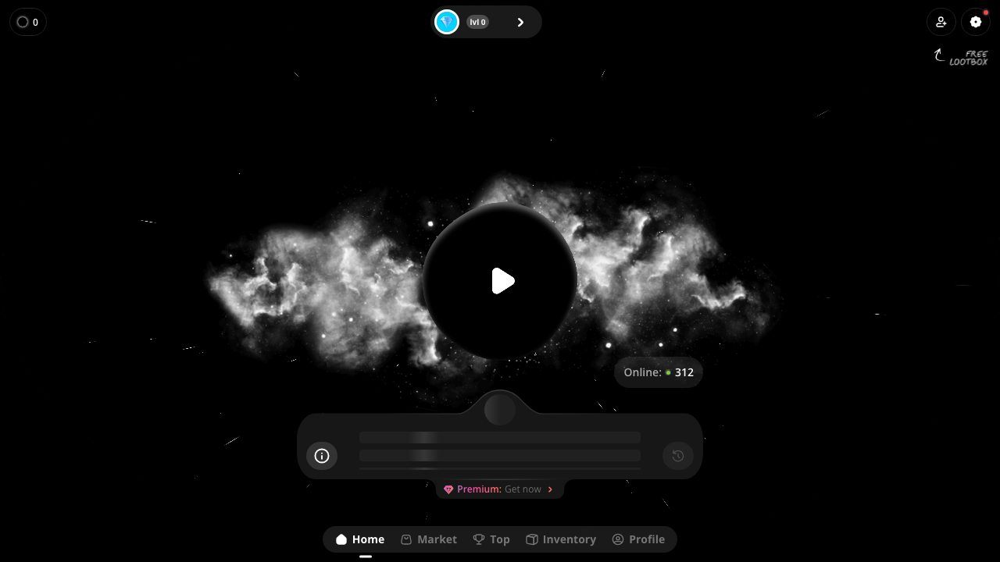
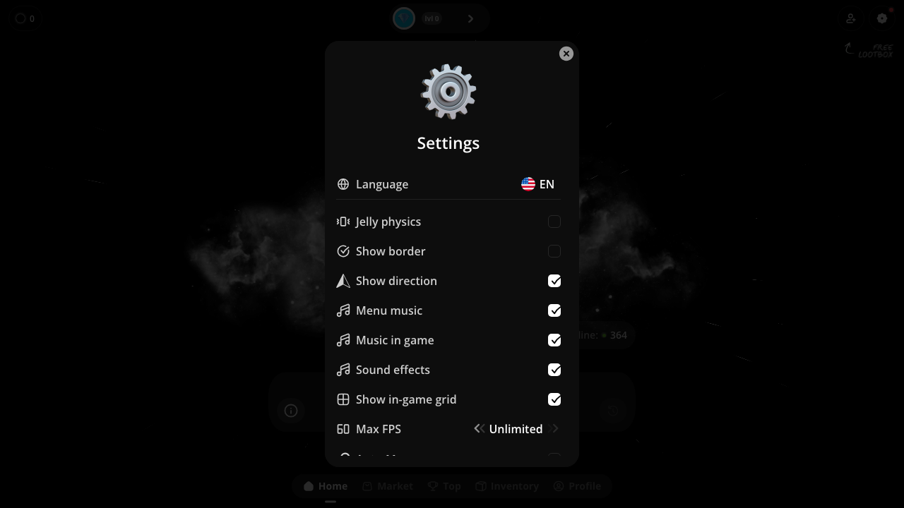
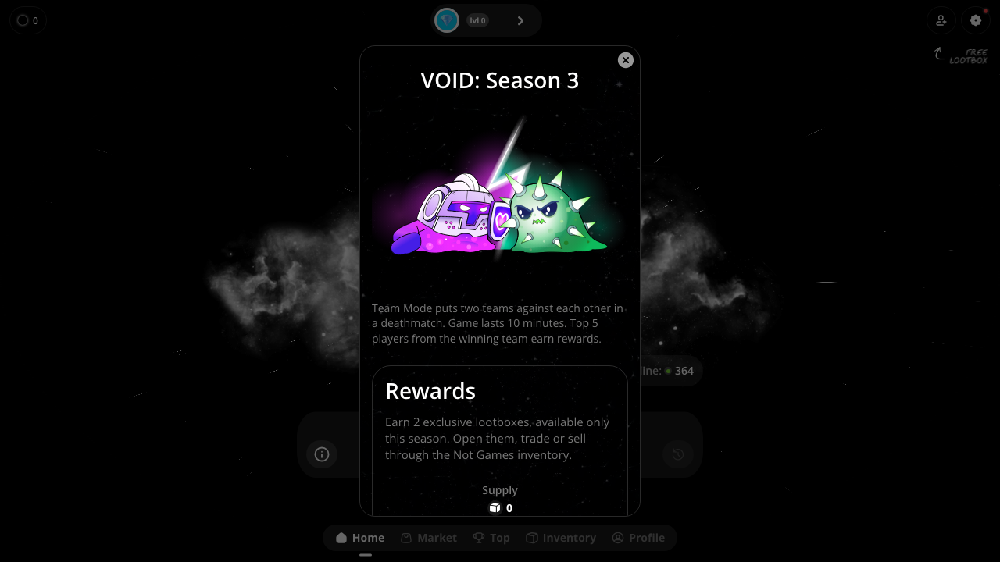
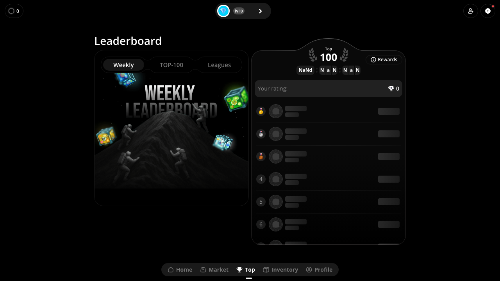
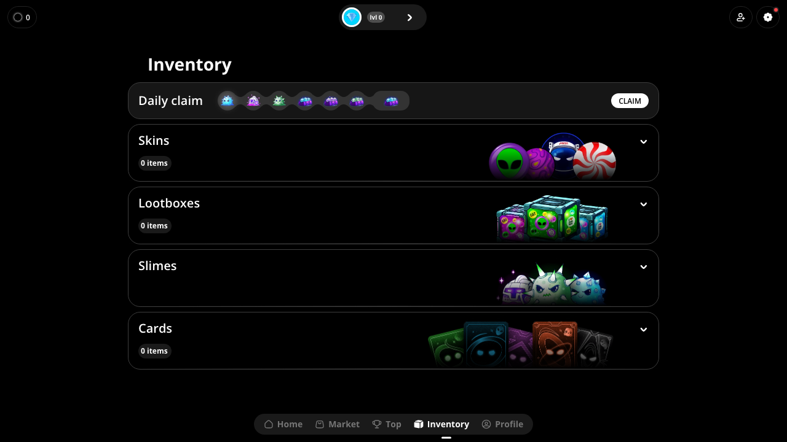
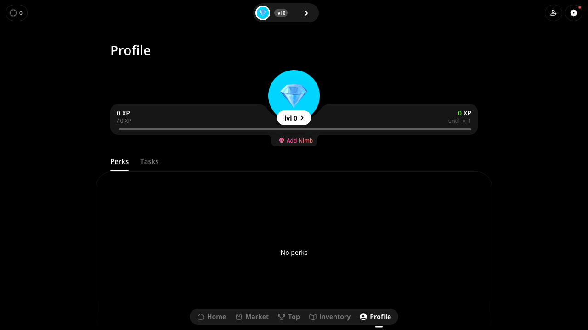
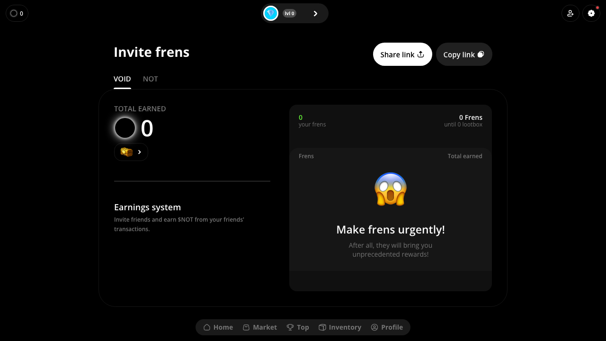

# Void Game — Competitor Analysis & Battle Circles Feature Roadmap

> **Research date:** February 2026  
> **Researcher role:** Senior game engineer + curious PM  
> **Subject:** https://app.voidgame.io — a Telegram-native blob/io game with crypto economy
> **Purpose:** Extract what they do well, identify gaps, define a phased plan to build something better

---

## Table of Contents

1. [What Void Is](#1-what-void-is)
2. [UX & Visual Design Observations](#2-ux--visual-design-observations)
3. [Game Mechanics Observed](#3-game-mechanics-observed)
4. [Full API Surface Reverse-Engineered](#4-full-api-surface-reverse-engineered)
5. [Economy & Monetisation Model](#5-economy--monetisation-model)
6. [What They Do Well](#6-what-they-do-well)
7. [Where They Are Weak](#7-where-they-are-weak)
8. [Battle Circles — Phased Improvement Roadmap](#8-battle-circles--phased-improvement-roadmap)
9. [API Routes We Need to Build](#9-api-routes-we-need-to-build)
10. [Open Questions](#10-open-questions)

---

## 1. What Void Is

Void is an agar.io-style blob game built as a **Telegram Mini App** (runs inside Telegram's in-app browser). Players control a circle that grows by consuming smaller entities and other players. The game is deeply integrated with the **TON blockchain** and Telegram's identity/wallet layer.

Key facts:

- ~300–500 concurrent online players observed during research session
- Built entirely as a mobile-first vertical app (portrait layout, full-screen)
- Season-based competitive structure (Season 3 observed) with leagues and ranked rating
- Revenue model: Premium subscription + cosmetic skins + lootboxes + crypto marketplace
- Crypto integration: TON blockchain, $NOT token, $VOID token, TRX currency all observed
- Version at time of research: **v1.8.84**

---

## 2. UX & Visual Design Observations

### Home Screen



The home screen is the strongest single UX decision in the entire product:

| Element | What it does | Why it works |
|---|---|---|
| **Animated nebula background** | Full-screen particle/cloud animation loops behind the play button | Creates atmosphere immediately; the game feels alive before you touch it |
| **Giant centred Play button** | One tap to enter the game, no name entry, no friction | Lowest possible TTFG (time to first game) for returning users |
| **"Online: 312" live counter** | Real-time player count, green pulsing dot | Social proof; if people are online, the game feels worth playing |
| **Level pill (lvl 0 →)** | Top-centre persistent XP/level indicator with tap-to-expand | Constant progression reminder; the `→` suggests there's more to see |
| **Currency counter (top-left)** | Coin balance always visible | Economy is front-of-mind even on the home screen |
| **"FREE LOOTBOX" CTA (top-right)** | Arrow pointing to it with label | First-visit hook; gambles the user into the reward loop immediately |
| **"Premium: Get now →" banner** | Persistent pink banner at the very bottom of the play area | Upsell is never intrusive but always visible |
| **Music player bar** | Animated progress bar at bottom with back/forward controls | Menu music is playing — the game has ambient audio on the home screen |
| **Season/League info card** | Swipeable card below play button showing current season and rating | Players know exactly what they're competing for without navigating |

### Navigation

Five-tab bottom navigation: **Home · Market · Top · Inventory · Profile**

This is the right architecture. Everything a player needs is one tap away, and the active tab is clearly highlighted. The icons are small but legible at mobile scale.

### Settings Screen



Settings are comprehensive and signal a mature product:

- Language selector (internationalisation)
- **Jelly physics** toggle — cosmetic physics effect on your circle
- Show border toggle
- Show direction arrow toggle
- **Menu music** toggle (on by default)
- **Music in game** toggle (on by default)
- **Sound effects** toggle (on by default)
- Show in-game grid toggle
- **Max FPS selector** (30 / 60 / 120 / 144 / Unlimited)
- Auto-Move toggle
- Show game logs toggle
- Bind buttons (custom control mapping)

The FPS selector and control binding are power-user features that signal respect for competitive players.

### Season Info Modal



On first visit, a modal explains the current season:
- Season name, artwork, and game mode description
- **Team Mode** — two teams, 10-minute deathmatch, top 5 from winning team earn rewards
- Reward details: exclusive lootboxes with **limited supply counter** (scarcity mechanic)
- Rating system explanation
- League progression map (5 leagues, guaranteed lootbox on promotion)

### Leaderboard Screen



Three tabs: **Weekly · TOP-100 · Leagues**

- Weekly leaderboard with gold/silver/bronze medal icons
- "Your rating: 0 🏆" — player's own position is always shown even if they're not in top 100
- Rewards button top-right explains what each rank earns
- Season timer showing time remaining (NaNd shown for unauthenticated user)

### Inventory Screen



Four collapsible sections:
1. **Daily claim** — 7-day streak icons with a CLAIM button (the most important retention mechanic)
2. **Skins** — 0 items, but shows preview art of several available skins
3. **Lootboxes** — 0 items
4. **Slimes** (character collectibles)
5. **Cards** — a card collection system

### Profile Screen



- Avatar (circle with gem icon)
- **XP progress bar** spanning full width with current/next level
- "0 XP until lvl 1"
- **Perks** tab — purchasable/earnable gameplay modifiers
- **Tasks** tab — quest/mission system
- "Add Nimb" button — social/friend feature

### Invite Frens Screen



- "Invite frens" with Share link + Copy link buttons
- Two tabs: **VOID** and **NOT** (two different reward currencies for referrals)
- Total earned counter
- Friend count with "until next lootbox" progress
- Earnings system explanation: earn $NOT from friends' transactions (affiliate model)

---

## 3. Game Mechanics Observed

### Core Loop

1. Land on home screen → see live player count → tap Play
2. Enter match (no waiting room friction observed)
3. Eat food/knibbles → grow → eat smaller players → grow more
4. 10-minute match timer
5. Match ends → lootbox/reward screen → back to home

### Seasonal Structure

- Named seasons (Season 3 observed)
- Each season has a specific **game mode** (Team Mode in S3)
- Season-exclusive lootboxes with tracked supply (scarcity = urgency)
- Rating system: win → gain points, lose → lose points
- 5 leagues from lowest to highest, with guaranteed lootbox on each promotion

### Rating / League System

From the API (`/api/game-seasons-leagues`) and text observed:
- **Star League** baseline
- ~20 points gained per win, ~15 lost per loss
- Asymmetric point structure incentivises playing when you're good

### Perks System

From `/api/user-perks?currency=TRX` — response was 178KB, suggesting a large perk catalogue. Perks are purchasable gameplay modifiers, priced in crypto currency (TRX observed).

### Skins System

From `/api/user-skins` — skins are equippable circle appearances. The instant roulette (`/api/instant-roulette/available-burn-skins`) lets players "burn" (destroy) skins to get roulette spins — a clever sink mechanic.

### Potions System

From `/api/user-potions` — single-use consumable items. Response was 42KB suggesting many variants.

### Cards System

Collectible cards visible in inventory. From `/api/shop/items` (34KB response) — likely cards, skins, and lootboxes are all sold in a unified shop.

---

## 4. Full API Surface Reverse-Engineered

All endpoints are REST, authenticated via Telegram identity. Base URL: `https://api.voidgame.io/api/`

### User Identity & State

| Endpoint | Method | Description |
|---|---|---|
| `/user-level` | GET | Player XP, current level, XP to next level |
| `/user-subscription` | GET | Premium subscription status and expiry |
| `/user-skins` | GET | All skins the user owns |
| `/user-potions` | GET | All potions/consumables the user owns |
| `/user-perks` | GET | All perks (with `?currency=TRX` param) |

### Game Seasons

| Endpoint | Method | Description |
|---|---|---|
| `/game-seasons/online` | GET | **Live player count** — polled frequently, response is just 14 bytes (`{"online":312}`) |
| `/game-seasons-leagues` | GET | League definitions, thresholds, rewards |
| `/game-seasons/[id]` | GET | Season details, mode, reward pool |

### Ranked & Match History

| Endpoint | Method | Description |
|---|---|---|
| `/user-game-season-results/my` | GET | Current season stats for the authenticated user |
| `/user-game-season-results/claims` | GET | Claimable rewards from season results |
| `/user-ranked-analytic/history` | GET | Full match history with rating deltas |

### Economy & Monetisation

| Endpoint | Method | Description |
|---|---|---|
| `/sale-events` | GET | Active sale/discount events (11KB — many items) |
| `/shop/items` | GET | Full shop catalogue (34KB) |
| `/user-perks?currency=TRX` | GET | Perk shop filtered by currency |
| `/instant-roulette/available-burn-skins` | GET | Skins eligible to burn for roulette spins |
| `/daily-claim` | GET | Daily reward status and streak |
| `/daily-claim` | POST | Claim today's reward |

### Referrals

| Endpoint | Method | Description |
|---|---|---|
| `/referrals/rewards` | GET | Referral reward catalogue (23KB — tiered rewards) |
| `/referrals/my?page=0&limit=10` | GET | Paginated list of user's referred friends |

### Infrastructure Notes

- All responses arrive in **< 600ms** total round-trip including auth overhead — fast, well-cached
- `/game-seasons/online` is polled every ~17 seconds (observed from request timing) — lightweight SSE alternative
- Response sizes are very small due to aggressive compression (Brotli/gzip) — 14KB raw → 18 bytes compressed for the online count
- The API is clearly versioned and feature-flagged — unauthenticated users get graceful empty states, not errors

---

## 5. Economy & Monetisation Model

Void runs a **multi-currency crypto-native economy**:

| Currency | Type | Used for |
|---|---|---|
| **$VOID** | In-game token | Primary reward currency, earned in matches |
| **$NOT** | Telegram ecosystem token | Referral rewards, affiliate earnings |
| **TON** | Crypto (The Open Network) | Market trading, premium items |
| **TRX** | Crypto (Tron) | Perk purchases |

### Revenue Streams

1. **Premium subscription** — persistent "Get now" CTA, gives ongoing benefits
2. **Lootbox sales** — direct purchase and season rewards
3. **Skin marketplace** — player-to-player trading at TON prices (Void takes a cut)
4. **Perks** — purchasable gameplay modifiers priced in TRX
5. **Sale events** — timed discount events to drive impulse purchases
6. **Roulette** — burn skins for a chance at rarer ones (gambling mechanic)

### Retention Mechanics

1. **Daily claim** — 7-day streak with escalating rewards visible upfront
2. **Season timer** — FOMO from season-exclusive lootbox supply ticking down
3. **League progression** — guaranteed lootbox at each new league (milestone rewards)
4. **Referral earnings** — passive income from friends' transactions
5. **Free lootbox** — first-visit hook on the home screen

---

## 6. What They Do Well

These are the mechanics worth directly learning from:

### ✅ Zero-friction home screen
The play button is the entire home screen. No name entry, no lobby waiting, no menus to navigate. You tap Play and you're in a game. Returning users have zero friction.

### ✅ Live online count on home screen
`Online: 312` with a pulsing green dot. It's pulled from a dedicated endpoint (`/game-seasons/online`, 14 bytes) and polled every 17s. It works as social proof and reduces "is anyone playing?" anxiety before you commit to a match.

### ✅ Menu music on by default
The home screen plays ambient music immediately. It's toggleable in settings but on by default. This is a deliberate atmosphere choice — the game has a mood before you start playing.

### ✅ Daily claim with visible streak
The 7 reward icons are shown up front in the Inventory screen. You see exactly what day 1–7 give you. The psychology is: missing a day feels like a concrete loss, not an abstract one.

### ✅ Season structure with named game modes
Each season has a specific twist (Team Mode in S3). This is how you keep the game fresh without rebuilding it. The season is finite (supply counter on rewards creates urgency) and has a defined end state.

### ✅ Leaderboard always shows your own rank
Even if you're rank #4,891, you see "Your rating: 0 🏆" at the top of the leaderboard. You always know where you stand. This is better than hiding low-rank players from themselves.

### ✅ Referral → crypto earnings
Earning $NOT from friends' marketplace transactions is a genuinely compelling referral model. It's passive income, not a one-time bonus. Players become evangelists because their wallet depends on it.

### ✅ Skin burn → roulette
Destroying a common skin for a chance at a rare one is a clever supply/demand mechanic. It reduces the supply of commons, increases the value of rares, and creates engagement even for players who aren't buying anything.

### ✅ Perks system
Named gameplay modifiers purchasable with crypto. Not pay-to-win at the entry level (the game is still fair) but pay-for-edge at the top end. The 178KB response suggests dozens of perks with fine-grained effects.

### ✅ Settings depth
FPS cap, custom button bindings, jelly physics, grid toggle — these settings signal that the developers respect competitive players. Power users feel seen.

---

## 7. Where They Are Weak

These are genuine gaps and opportunities:

### ❌ Telegram-only identity

Without a Telegram account you cannot save progress, equip skins, earn rewards, or appear on leaderboards. For a global audience, this is a hard wall. **We should support multiple auth methods** (Discord, Google, email) with Telegram as one option, not a requirement.

### ❌ No desktop experience

The game is portrait-only and mobile-first to the point of being broken on desktop. The Market page is completely empty on desktop. **We are building landscape-first — this is already a differentiator.**

### ❌ The waiting room has no personality

Getting into a match has no lobby experience. There's no player preview, no countdown theatre. It just loads. **An animated player previews, and a visible countdown is an easy win.**

### ❌ Crypto-first is also crypto-alienating

Having 4 different currencies (VOID, NOT, TON, TRX) is confusing for non-crypto users. Many players who would otherwise pay money are blocked by wallet setup friction. **A simple fiat payment path (Stripe) alongside optional crypto is more accessible.**

### ❌ No spectator mode or replay

No way to watch others play or review your own games. **Match replays are a strong retention and skill-building feature.**

### ❌ No social features beyond referrals

There are no friends lists, party invites, or private lobbies visible in the product. The referral system earns you money but doesn't create in-game social bonds.

### ❌ The onboarding is cold

First-time users see a "Link your Telegram to continue" gate. There's no tutorial, no demo, no way to try the game before signing up. **We should let new users play one match as a guest, then prompt for sign-up at end-of-game when they're already invested.**

---

## 8. Battle Circles — Phased Improvement Roadmap

Each phase builds on the previous. No phase should start before the one before it ships.

---

### Phase 1 — Foundation (do this now, weeks 1–3)

These are the things that make the game actually playable end-to-end. Most are already in progress.

| Feature | Why | Notes |
|---|---|---|
| **Auth — guest ID + Discord OAuth** | Identity is the prerequisite for everything | `guestId` in `localStorage`, Discord for social proof |
| **Persist player name across sessions** | Currently lost on refresh | Store in `sessionStorage` with reconnect token |
| **REST API scaffold** | Socket handles game loop; HTTP handles user data | See §9 for full route list |
| **Prisma schema** | User, GameSession, PlayerResult tables | As defined in `architecture-scaling-decisions.md` |
| **Live online counter on home page** | Direct steal from Void — 14 bytes, massive social proof | Polled from `/api/game-seasons/online` every 15s |
| **Fix keyboard controls** | Already done — WASD/arrows | ✅ shipped |
| **Remove pause button** | Already done | ✅ shipped |

---

### Phase 2 — Polish & Retention (weeks 4–6)

The game works. Now make it feel good and give people a reason to come back.

| Feature | Why | Notes |
|---|---|---|
| **Menu music + ambient sound** | Void does this on home screen — it sets the mood | Use Howler.js; toggle in settings; on by default |
| **Sound effects** | Eat sound, grow sound, death sound, split sound | Critical for game feel |
| **Settings panel** | Music toggle, SFX toggle, show grid toggle, FPS cap | Copy Void's settings list — it's well-designed |
| **Waiting room redesign** | Add animated countdown, player avatars, room music | Currently bare bones |
| **Daily claim / streak rewards** | #1 retention mechanic — 7-day visible streak | Backed by `POST /api/daily-claim` |
| **Animated home screen** | Particle/nebula background on home page | PIXI.js or CSS animation |
| **Game over screen with stats** | Show rank, score, largest size, players eaten | Currently navigates straight to home |
| **Client-side interpolation** | 60fps smooth movement between 20Hz server ticks | Critical for game feel on mobile |

---

### Phase 3 — Progression & Identity (weeks 7–10)

Give players a persistent identity they care about protecting.

| Feature | Why | Notes |
|---|---|---|
| **XP and level system** | Core progression loop — gives every match meaning | Gain XP per match, per eat, per win |
| **Profile page** | Avatar, level bar, match history, stats | `/api/user-level`, `/api/user-ranked-analytic/history` |
| **Leaderboard — Weekly + All-time** | Always show player's own rank even if not top 100 | Void does this well |
| **Skins — basic colour/pattern packs** | Cosmetic personalisation, first earnable/buyable item | No gameplay advantage |
| **Match history** | Last 10 games, score, placement, XP earned | Backed by `GameSession` + `PlayerResult` tables |
| **Season structure** | Named season, fixed duration, season-exclusive rewards | Creates urgency and novelty |

---

### Phase 4 — Monetisation (weeks 11–14)

Don't build this before phases 1–3 are solid. Monetisation on top of a shaky game destroys trust.

| Feature | Why | Notes |
|---|---|---|
| **Token economy** | Earn tokens in-game, spend on cosmetics | As designed in `architecture-scaling-decisions.md` |
| **Stripe — Pro subscription** | Monthly recurring revenue, fiat-first | Monthly token stipend + premium badge + no-ads |
| **Skin shop** | Buy skins with tokens or real money | Cosmetic only — no gameplay advantage |
| **Lootboxes** | Win from daily claims and ranked rewards, buy extra | Season-exclusive supply creates urgency |
| **Referral system** | Earn tokens from friends' activity | Share link → track via referral code |
| **"Free lootbox" first-visit hook** | Immediately introduces the reward loop | Show on home screen for new users only |

---

### Phase 5 — Social & Virality (weeks 15–18)

Players who bring friends stay longer than players who play alone.

| Feature | Why | Notes |
|---|---|---|
| **Friends list** | Add friends by username, see online status | Enables party play |
| **Private rooms** | Create a room, share a link, play with friends | Token cost or Pro-only |
| **Party system** | Join a match together as a pre-formed group | Queues all party members into same match |
| **Invite frens page** | Share link, track referrals, earn rewards | Copy Void's two-tab (earned vs pending) layout |
| **Telegram bot** | Daily reminder, match results, leaderboard updates | Optional — only if Telegram audience is prioritised |

---

### Phase 6 — Competitive & Crypto (weeks 19–24)

For the audience that wants a ranked grind and/or crypto integration.

| Feature | Why | Notes |
|---|---|---|
| **Ranked mode** | Separate queue, ELO-like rating, seasonal reset | Void's League system is the template |
| **5-league progression** | Bronze → Silver → Gold → Platinum → Diamond | Guaranteed lootbox on each promotion |
| **Team mode** | 2v2 or 3v3 within the same map | Void Season 3 game mode |
| **Telegram Mini App** | Ship inside Telegram — access their 900M user base | Requires Telegram OAuth + Mini App manifest |
| **TON wallet integration** | Let users connect TON wallet for crypto rewards | Optional layer — fiat path stays primary |
| **$BATTLE token** | In-game earn-and-spend token with optional on-chain settlement | Only after the fiat economy is proven |

---

## 9. API Routes We Need to Build

This is the full REST API surface implied by both our architecture decisions and Void's observed API. These sit alongside the existing Socket.io game server.

### Authentication

```
POST   /api/auth/guest              — create anonymous guest session, return guestId + JWT
POST   /api/auth/discord            — OAuth callback, upsert user, return JWT
POST   /api/auth/telegram           — Telegram Mini App initData verification, return JWT
POST   /api/auth/refresh            — refresh JWT using refresh token
DELETE /api/auth/session            — logout, invalidate refresh token
```

### User

```
GET    /api/user/me                 — current user profile (name, level, XP, tier, tokens)
PATCH  /api/user/me                 — update display name, avatar
GET    /api/user/level              — XP, current level, XP to next level, level history
GET    /api/user/subscription       — premium tier, expiry date, benefits
```

### Game Seasons & Online Count

```
GET    /api/seasons/current         — current season details, mode, end date
GET    /api/seasons/online          — { online: number } — lightweight poll endpoint
GET    /api/seasons/leagues         — league definitions, thresholds, rewards per league
```

### Matches & Stats

```
GET    /api/matches/history         — paginated match history for authenticated user
GET    /api/matches/:id             — single match result detail
GET    /api/matches/my-season-stats — current season: wins, losses, rating, rank
POST   /api/matches/:id/claim       — claim rewards from a finished match
```

### Leaderboard

```
GET    /api/leaderboard/weekly      — top 100 + caller's own rank
GET    /api/leaderboard/all-time    — top 100 + caller's own rank
GET    /api/leaderboard/leagues     — per-league top players
```

### Daily Rewards

```
GET    /api/daily-claim             — current streak, today's reward, days 1–7 preview
POST   /api/daily-claim             — claim today's reward (idempotent within 24h window)
```

### Inventory & Skins

```
GET    /api/user/skins              — all skins the user owns
POST   /api/user/skins/:id/equip    — equip a skin for next match
GET    /api/shop/skins              — all purchasable skins with prices
POST   /api/shop/skins/:id/buy      — purchase a skin with tokens or Stripe payment intent
```

### Tokens & Economy

```
GET    /api/user/tokens             — current balance + lifetime earned
GET    /api/user/tokens/history     — transaction ledger (earn events, spend events)
POST   /api/tokens/earn             — internal: award tokens after match (called by game server)
POST   /api/tokens/spend            — internal: deduct tokens for purchase
```

### Lootboxes

```
GET    /api/user/lootboxes          — owned lootboxes
POST   /api/user/lootboxes/:id/open — open a lootbox, return contents
GET    /api/shop/lootboxes          — purchasable lootboxes with supply counts
POST   /api/shop/lootboxes/:id/buy  — purchase lootbox
```

### Referrals

```
GET    /api/referrals/my            — my referral code + count of referred friends
GET    /api/referrals/rewards       — reward tiers (e.g. 5 friends = lootbox)
GET    /api/referrals/friends       — paginated list of referred friends + their activity
POST   /api/referrals/register      — register that a user joined via referral code ?ref=CODE
```

### Subscriptions (Stripe)

```
POST   /api/subscription/checkout  — create Stripe checkout session
POST   /api/subscription/webhook   — Stripe webhook receiver (signature verified)
DELETE /api/subscription           — cancel subscription at period end
GET    /api/subscription           — current status (same as /user/subscription)
```

### Settings

```
GET    /api/user/settings           — user preferences (music, sfx, grid, fps cap, etc.)
PATCH  /api/user/settings           — update preferences
```

---

## 10. Open Questions

These are the decisions that need a call before we build the relevant phase:

| Question | Options | Recommended |
|---|---|---|
| Do we build inside Telegram first? | Yes (Telegram Mini App) vs No (standalone web first) | **Standalone web first** — then add Telegram as a channel in Phase 6. The audience is larger and the product is easier to build without Telegram constraints. |
| Do we do crypto at all? | TON/NOT like Void, or fiat-only | **Fiat first (Stripe), crypto optional in Phase 6.** Crypto adds integration complexity and alienates a large segment of potential players. |
| What is our hero differentiator vs Void? | Better desktop UX? Better social? Better game feel? | **Game feel + desktop-first + squad play.** Void is broken on desktop. We are landscape-first and keyboard-controlled. That is already a different audience. |
| Seasonal cadence? | Monthly / quarterly / indefinite | **6-week seasons** — long enough to matter, short enough to stay fresh. |
| What is the free-to-play daily experience? | How much can you earn without paying? | **Enough to earn 1–2 cosmetics per month via daily play.** Never paywalled for core gameplay. |
| Should the waiting room have matchmaking? | Global room vs skill-based matchmaking | **Global room now; ELO-based in Phase 6.** Early games need all players in one pool to avoid empty lobbies. |
